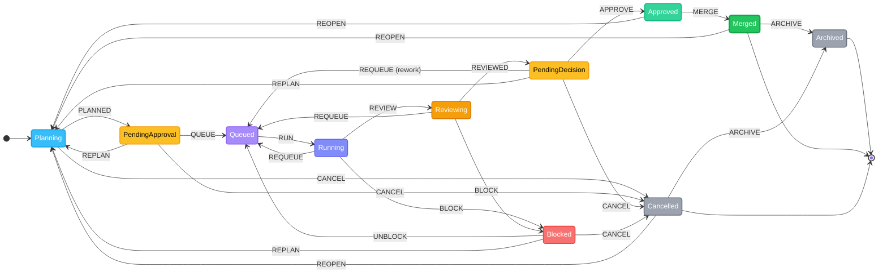

<p>
  
</p>

## fifony

**AI agents that actually ship code. You just watch.**

Point at a repo. Open the dashboard. AI plans, builds, and reviews — you approve and merge.

[](LICENSE) []()

<div style="clear:both"></div>

---

## Quick Start

```bash
npx -y fifony
```

Open **http://localhost:4000**. The first run launches the onboarding wizard — it detects your CLIs, scans your project, and configures everything in six steps. State lives in `.fifony/`. No accounts, no cloud, no external database.

fifony executes each issue in an isolated git worktree. If you are starting from an empty folder, initialize git and create the first commit before execution. The onboarding Setup step can do this for you automatically.

<div align="center">

</div>

---

## How It Works

fifony auto-detects your installed CLI tools (Claude, Codex, Gemini) and routes each pipeline stage to the best available provider. Configure per-stage provider, model, and reasoning effort in the Settings UI or drop a `WORKFLOW.md` in your project root.

### Issue Lifecycle



| Step | Who | State | What happens |
|------|-----|-------|-------------|
| **Create** | You | → Planning | Describe what you want — type or **dictate by voice**. Hit **Enhance** — AI rewrites your spec with acceptance criteria and edge cases. |
| **Plan** | AI | Planning | The planner generates a structured execution plan: phases, steps, target files, complexity, risks. |
| **Approve plan** | You | PendingApproval → Queued | You review the plan. Optionally refine with AI chat before approving. |
| **Execute** | AI | Running | Agents run in an isolated git worktree. Live output streams to the dashboard. |
| **Review** | AI | Reviewing | The reviewer inspects the diff — approves, requests rework, or blocks. |
| **Decide** | You | PendingDecision → Approved | You confirm the review. Approve to merge, request rework, or replan. |
| **Merge** | You | Approved → Merged | Merge the worktree into your project. Analytics capture lines added/removed. |
| **Archive** | You | Merged/Cancelled → Archived | Soft-delete: issue disappears from all views but stays in the database. |

**Retry operations** are semantically distinct — each has its own command, FSM path, and prompt context:

| Retry | Command | What happens |
|-------|---------|-------------|
| **Replan** | `replanIssueCommand` | Archives current plan, increments plan version, resets execution/review counters, generates fresh plan. |
| **Re-execute** | `retryExecutionCommand` | Retries from Blocked. Prior failure insights analyzed and injected into prompt — agent avoids repeating the same mistake. |
| **Rework** | `requestReworkCommand` | Reviewer requested changes. Feedback archived as structured failure insight, issue re-queued for another execution attempt. |

Agents run as detached child processes, tracked by PID. If the server restarts mid-run, fifony recovers on the next boot.

<div align="center">

<br><sub>Create an issue and hit Enhance — AI writes a full spec</sub>
<br><br>

<br><sub>Review the AI-generated plan, refine it, then approve to start execution</sub>
</div>

---

## Onboarding Wizard

The first run walks you through six steps:

| Step | What happens |
|------|-------------|
| CLI Detection | Finds `claude`, `codex`, `gemini`, `git`, `node`, `docker`, and other tools on your system |
| Project Scan | Detects language, stack, and build system — 18+ ecosystems supported |
| AI Analysis | Uses the detected CLI to extract domain context from your codebase |
| Domains | 21 options across Technical / Industry / Role, pre-selected by the AI |
| Agents & Skills | Catalog of 15 agents and 5 skills, auto-recommended for your domains |
| Effort & Workers | Per-stage reasoning effort, worker concurrency, and visual theme |

Settings are saved progressively and can be re-run from Settings at any time.

The Setup step blocks execution until the workspace is a git repository with at least one commit, because `git worktree` needs a base commit.

---

## Dashboard

| Route | What you see |
|-------|-------------|
| `/kanban` | Drag-and-drop board with 5 columns: Planning, In Progress, Reviewing, Blocked, Done. |
| `/issues` | Searchable list with multi-state filters, issue type filters, and sort options. |
| `/agents` | Live cockpit: worker slots, queue depth, real-time log tail, token totals with hourly sparkline. |
| `/analytics` | Token usage trends, daily and weekly rollups, top issues by tokens and cost, per-model breakdown. |
| `/settings` | General, Workflow pipeline config, Notifications, Providers, Hotkeys reference. |

The **Issue Detail Drawer** shows the full plan (phases and steps), the workspace diff, and a per-phase token breakdown — Plan / Execute / Review — with input and output counts per model.

### Managed Services — Environment Variables

Environment variables for managed services are stored via **Vaulter** (SQLite at `.fifony/secrets.db`) and injected at process startup.

- **Global variables** (`Settings → Services → Global variables`) — injected into every service.
- **Per-service variables** (`Settings → Services → <service> → Variables`) — injected only into that service and override global variables of the same key.

Variables are applied on the **next start or restart** of the service — a process already running does not receive changes automatically.

The injection order (last wins):
```
global vars  →  per-service vars  →  PORT (enforced, always wins)
```

### Managed Services Port Contract

Managed services started by fifony must bind to the `PORT` environment variable.

- If you configure a service port manually, fifony injects that value as `PORT`.
- If you leave the port empty, fifony assigns a free local port above `12000`, persists it, and injects it as `PORT` on startup.
- Reverse proxy routing by service and mesh topology resolution both depend on each managed service having a resolvable port.

### Reverse Proxy — Local HTTPS Setup (Linux)

fifony includes a built-in HTTPS reverse proxy for routing `.local` domains (e.g. `https://admin.tetis.local`) to managed services. Two one-time host setup steps are required:

**1. Allow binding to port 443 without root**

By default, Linux only allows root processes to bind to ports below 1024. Lower the limit permanently:

```bash
echo "net.ipv4.ip_unprivileged_port_start=443" | sudo tee /etc/sysctl.d/99-local-dev.conf
sudo sysctl -p /etc/sysctl.d/99-local-dev.conf
```

Then set the HTTPS Port to `443` in **Settings → Services**.

**2. Trust the local CA certificate**

fifony generates a self-signed CA at `.fifony/tls/ca.pem` on first run. Install it so the browser accepts the certificates:

```bash
# System-wide (curl, etc.)
sudo cp .fifony/tls/ca.pem /usr/local/share/ca-certificates/fifony-ca.crt
sudo update-ca-certificates

# Chrome / Chromium on Linux (NSS)
certutil -d sql:$HOME/.pki/nssdb -A -t "CT,," -n "fifony Local CA" -i .fifony/tls/ca.pem
```

Restart Chrome after running `certutil`. After both steps, `.local` domains resolve and display the green padlock with no warnings.

**macOS**

Port 443 requires a `pf` redirect (no sysctl equivalent on macOS). Create `/etc/pf.anchors/fifony`:

```
rdr pass inet proto tcp from any to any port 443 -> 127.0.0.1 port 4433
```

Load it (survives reboots when added to `/etc/pf.conf`):

```bash
# One-time load
echo "rdr pass inet proto tcp from any to any port 443 -> 127.0.0.1 port 4433" | sudo pfctl -ef -

# Permanent — add to /etc/pf.conf then:
sudo pfctl -f /etc/pf.conf
```

Trust the CA via Keychain (Chrome uses the system keychain on macOS — no certutil needed):

```bash
sudo security add-trusted-cert -d -r trustRoot \
  -k /Library/Keychains/System.keychain \
  .fifony/tls/ca.pem
```

<div align="center">

<br><sub>Agents cockpit — live output, worker slots, token usage</sub>
<br><br>

<br><sub>Analytics — token trends, code churn, engineering KPIs, model breakdown</sub>
</div>

### Keyboard Shortcuts

Every frequent action is one or two keystrokes away. The full map is available via **Shift+/** or at `/settings/hotkeys`.

| Key | Context | Action |
|-----|---------|--------|
| <kbd>Ctrl</kbd>+<kbd>K</kbd> | Anywhere | Command palette — fuzzy-search issues, navigate, run actions |
| <kbd>N</kbd> | Global | New issue |
| <kbd>K</kbd> <kbd>I</kbd> <kbd>A</kbd> <kbd>T</kbd> <kbd>S</kbd> | Global | Navigate to Kanban / Issues / Agents / Analytics / Settings |
| <kbd>R</kbd> | Global | Refresh runtime state |
| <kbd>1</kbd>–<kbd>5</kbd> | Kanban | Jump to column |
| <kbd>J</kbd> / <kbd>K</kbd> | Kanban, Issues, Drawer | Navigate cards / issues (vim-style) |
| <kbd>Enter</kbd> | Kanban, Issues | Open focused card |
| <kbd>/</kbd> | Issues | Focus search |
| <kbd>]</kbd> / <kbd>[</kbd> | Drawer | Next / previous tab |
| <kbd>Ctrl</kbd>+<kbd>Enter</kbd> | Drawer | Primary action — Execute, Approve, or Merge depending on state |
| <kbd>Ctrl</kbd>+<kbd>A</kbd> | Drawer | Approve issue |
| <kbd>Ctrl</kbd>+<kbd>M</kbd> | Drawer | Merge issue |
| <kbd>Ctrl</kbd>+<kbd>W</kbd> | Drawer | Rework issue |
| <kbd>Esc</kbd> | Anywhere | Close topmost overlay |

Shortcuts are context-aware: drawer shortcuts only fire when an issue is open, kanban/issues shortcuts only on their page. Modifier combos (<kbd>Ctrl</kbd>/<kbd>Cmd</kbd>) work even inside input fields.

### Voice Input (Speech-to-Text)

Dictate issue titles and descriptions by voice. Click the microphone button next to any text field in the **New Issue** drawer — recording starts in continuous mode with a live waveform visualizer and elapsed timer. Speech is inserted at the cursor position, so you can dictate into the middle of existing text.

- **Browser-native** — uses the Web Speech API via `react-speech-recognition`, no external service
- **Cursor-aware** — inserts at caret position, not just appending
- **Visual feedback** — pulsing mic, frequency waveform bars, recording timer, and a Stop button
- **Graceful degradation** — mic button only appears in supported browsers (Chrome, Edge, Safari)

### PWA

Install as a desktop app. Offline app shell with update detection banner. Web push notifications for state transitions (works even with browser closed — enable in Settings > Notifications). Desktop notifications also available when tab is open. Service worker caches shell and static assets.

---

## Agents, Skills & Reference Repositories

fifony pulls agents and skills from four open-source reference repositories during onboarding:

| Repository | What it provides |
|------------|-----------------|
| **[LerianStudio/ring](https://github.com/LerianStudio/ring)** | 80+ specialist agents, skills, engineering standards, review commands, and prompt libraries for full-stack development. |
| **[msitarzewski/agency-agents](https://github.com/msitarzewski/agency-agents)** | Focused agent set for frontend, backend, QA, and review roles. |
| **[pbakaus/impeccable](https://github.com/pbakaus/impeccable)** | Frontend polish skills — design system enforcement, accessibility audits, and visual quality workflows. |
| **[affaan-m/everything-claude-code](https://github.com/affaan-m/everything-claude-code)** | Curated collection of Claude Code agents, workflows, and prompt engineering patterns. |

Repositories are cloned to `~/.fifony/repositories/` and synced on demand. During onboarding, fifony scans them and recommends agents/skills matching your project's domain. You pick what to install.

Agents install to `.claude/agents/` and `.codex/agents/`. Skills load from `SKILL.md` files in `.claude/skills/` or `.codex/skills/`.

```bash
# Manage reference repositories from the CLI
fifony onboarding list                                    # list repos and sync status
fifony onboarding sync                                    # sync all
fifony onboarding sync --repository ring                  # sync one
fifony onboarding import ring --kind agents               # import agents
fifony onboarding import impeccable --kind skills          # import skills
fifony onboarding import agency-agents --kind agents --overwrite  # overwrite existing
```

---

## CLI Reference

```bash
# Dashboard + API (default port 4000)
npx -y fifony

# Custom port
npx -y fifony --port 8080

# With Vite HMR for frontend development
npx -y fifony --dev

# MCP server (stdio)
npx -y fifony mcp

# Different workspace
npx -y fifony --workspace /path/to/repo

# Run one scheduler cycle and exit
npx -y fifony --once

# Fine-grained control
npx -y fifony --concurrency 2 --attempts 3 --poll 500
```

---

## MCP Server

Use fifony as tools inside your editor:

```bash
npx -y fifony mcp --workspace /path/to/repo
```

Add to `claude_desktop_config.json` or VS Code settings:

```json
{
  "mcpServers": {
    "fifony": {
      "command": "npx",
      "args": ["-y", "fifony", "mcp", "--workspace", "/path/to/repo"]
    }
  }
}
```

**Resources**: `fifony://state/summary`, `fifony://issues`, `fifony://issue/{id}`, `fifony://issue/{id}/plan`, `fifony://issue/{id}/diff`, `fifony://issue/{id}/events`, `fifony://workflow/config`, `fifony://analytics`, `fifony://guide/overview`, `fifony://guide/runtime`, `fifony://guide/integration`, `fifony://integrations`, `fifony://agents/catalog`, `fifony://skills/catalog`, `fifony://events/recent`

**Tools**: `fifony.status`, `fifony.list_issues`, `fifony.create_issue`, `fifony.get_issue`, `fifony.update_issue_state`, `fifony.cancel_issue`, `fifony.retry_issue`, `fifony.plan`, `fifony.refine`, `fifony.approve`, `fifony.merge`, `fifony.get_diff`, `fifony.get_live`, `fifony.get_events`, `fifony.enhance`, `fifony.analytics`, `fifony.get_workflow`, `fifony.scan_project`, `fifony.install_agents`, `fifony.install_skills`, `fifony.integration_config`, `fifony.list_integrations`, `fifony.integration_snippet`

**Prompts**: `fifony-integrate-client`, `fifony-plan-issue`, `fifony-route-task`, `fifony-use-integration`, `fifony-diagnose-blocked`, `fifony-weekly-summary`, `fifony-refine-plan`, `fifony-code-review`

---

## REST API

All endpoints are auto-documented via the s3db.js ApiPlugin. Open **http://localhost:4000/docs** for the interactive OpenAPI explorer with request/response schemas, try-it-out forms, and WebSocket details.

---

## Configuration

fifony reads a `WORKFLOW.md` in your project root if present. Front matter configures the pipeline; the Markdown body defines the execution contract. Settings from the UI write to `.fifony/s3db/`.

**Environment variables** (all optional when using the UI or WORKFLOW.md):

```bash
FIFONY_WORKSPACE_ROOT=/path/to/repo
FIFONY_PERSISTENCE=/path/to/state     # defaults to $FIFONY_WORKSPACE_ROOT
FIFONY_AGENT_PROVIDER=codex           # codex | claude
FIFONY_WORKER_CONCURRENCY=2
FIFONY_MAX_ATTEMPTS=3
FIFONY_AGENT_MAX_TURNS=4
FIFONY_LOG_FILE=0                     # set to 1 to also write .fifony/fifony-local.log
```

---

## Architecture

```
.fifony/
  s3db/           ← durable database (issues, events, sessions, settings)
  source/         ← project snapshot for diff reference
  workspaces/     ← per-issue git worktrees
```

| Layer | How it works |
|-------|-------------|
| **State machine** | 11 states, 14 events. States named by actor: AI (Planning, Running, Reviewing), Human (PendingApproval, PendingDecision, Approved), terminal (Merged, Cancelled, Archived). Archived = soft-delete, hidden from all views. |
| **Unified queue** | Single work queue with phase ordering (review → execute → plan). Semaphore for concurrency. No scheduler loop — event-driven dispatch. Planning runs outside the semaphore. |
| **Persistence** | s3db.js with SQLite backend. Issues, events, sessions, and settings are first-class resources. No external DB. |
| **Analytics** | `EventualConsistencyPlugin` tracks token usage, code churn (lines added/removed), and event counts with daily cohort rollups. |
| **Agents** | Wraps local CLIs (Claude, Codex, Gemini). Per-stage provider, model, and reasoning effort. No proprietary model logic. |
| **Isolation** | Each issue gets its own git worktree branch. Parallel work on the same repo without file conflicts. |
| **Routing** | Workflow configuration defines provider, model, and effort per stage. |

---

## Requirements

- Node.js 23 or newer
- git installed, with the target workspace initialized as a repository before issue execution
- At least one of: `claude` CLI, `codex` CLI, `gemini` CLI

---

## Credits

fifony is built on the shoulders of:

- **[raffel](https://github.com/forattini-dev/raffel)** — Unified multi-protocol server runtime.
- **[cli-args-parser](https://github.com/forattini-dev/cli-args-parser)** — CLI argument parsing.
- **[s3db.js](https://github.com/forattini-dev/s3db.js)** — Filesystem persistence layer.
- **[Agency Agents](https://github.com/msitarzewski/agency-agents)** — Inspiration for the agent catalog.
- **[Impeccable](https://github.com/pbakaus/impeccable)** — Frontend design skill by Paul Bakaus.
- **[DaisyUI](https://daisyui.com)** — Dashboard component library.

---

## License

Apache License 2.0 — see [LICENSE](LICENSE) for details.

This project includes code from OpenAI Codex CLI. See [NOTICE](NOTICE) for attribution.
