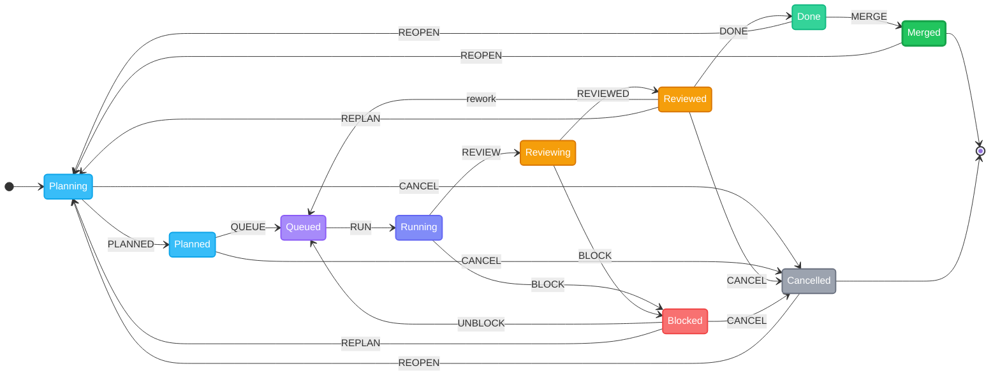

<p>
  
</p>

## fifony

**AI agents that actually ship code. You just watch.**

Point at a repo. Open the dashboard. AI plans, builds, and reviews — you approve and merge.

[](LICENSE) []()

<br clear="left" />

---

## Quick Start

```bash
npx -y fifony
```

Open **http://localhost:4000**. The first run launches the onboarding wizard — it detects your CLIs, scans your project, and configures everything in six steps. State lives in `.fifony/`. No accounts, no cloud, no external database.

---

## How It Works

fifony auto-detects your installed CLI tools (Claude, Codex, Gemini) and routes each pipeline stage to the best available provider. Configure per-stage provider, model, and reasoning effort in the Settings UI or drop a `WORKFLOW.md` in your project root.

### Issue Lifecycle



| Step | What happens |
|------|-------------|
| **Create** | Describe what you want done. Hit **Enhance** — AI rewrites your title and description into a clear, actionable spec with acceptance criteria, edge cases, and suggested labels. One click turns a vague idea into a well-scoped task. |
| **Plan** | The planner agent generates a structured execution plan: phases, steps, target files, complexity, risks. |
| **Approve** | You review the plan. Optionally refine it with AI chat before approving. |
| **Execute** | Agents run in an isolated git worktree. Live output streams to the dashboard. |
| **Review** | The reviewer agent inspects the diff and either approves, requests rework, or blocks. |
| **Done** | Approved and waiting for merge. You review the diff in the dashboard. |
| **Merge** | You merge the worktree into your project. Analytics capture lines added/removed. |

Agents run as detached child processes, tracked by PID. If the server restarts mid-run, fifony recovers on the next boot.

---

## Onboarding Wizard

The first run walks you through six steps:

| Step | What happens |
|------|-------------|
| CLI Detection | Finds `claude`, `codex`, `gemini`, `git`, `node`, `docker`, and other tools on your system |
| Project Scan | Detects language, stack, and build system — 18+ ecosystems supported |
| AI Analysis | Uses the detected CLI to extract domain context from your codebase |
| Domains | 21 options across Technical / Industry / Role, pre-selected by the AI |
| Agents & Skills | Catalog of 15 agents and 5 skills, auto-recommended for your domains |
| Effort & Workers | Per-stage reasoning effort, worker concurrency, and visual theme |

Settings are saved progressively and can be re-run from Settings at any time.

---

## Dashboard

| Route | What you see |
|-------|-------------|
| `/kanban` | Drag-and-drop board with 5 columns: Planning, In Progress, Reviewing, Blocked, Done. |
| `/issues` | Searchable list with multi-state filters, sort options, and capability filters. |
| `/agents` | Live cockpit: worker slots, queue depth, real-time log tail, token sparklines per agent. |
| `/analytics` | Token usage trends, daily and weekly rollups, top issues by cost, per-model breakdown. |
| `/settings` | General, Workflow pipeline config, Notifications, Providers. |

The **Issue Detail Drawer** shows the full plan (phases and steps), all execution sessions, the workspace diff, and a per-phase token breakdown — Plan / Execute / Review — with input and output counts per model.

### PWA

Install as a desktop app. Works offline. Desktop notifications when issues change state. Service worker with stale-while-revalidate caching.

---

## Agents, Skills & Reference Repositories

fifony pulls agents and skills from three open-source reference repositories during onboarding:

| Repository | What it provides |
|------------|-----------------|
| **[LerianStudio/ring](https://github.com/LerianStudio/ring)** | 80+ specialist agents, skills, engineering standards, review commands, and prompt libraries for full-stack development. |
| **[msitarzewski/agency-agents](https://github.com/msitarzewski/agency-agents)** | Focused agent set for frontend, backend, QA, and review roles. |
| **[pbakaus/impeccable](https://github.com/pbakaus/impeccable)** | Frontend polish skills — design system enforcement, accessibility audits, and visual quality workflows. |

Repositories are cloned to `~/.fifony/repositories/` and synced on demand. During onboarding, fifony scans them and recommends agents/skills matching your project's domain. You pick what to install.

Agents install to `.claude/agents/` and `.codex/agents/`. Skills load from `SKILL.md` files in `.claude/skills/` or `.codex/skills/`. fifony infers the right agent from the issue description and target file paths — capability routing is automatic.

```bash
# Manage reference repositories from the CLI
fifony onboarding list                                    # list repos and sync status
fifony onboarding sync                                    # sync all
fifony onboarding sync --repository ring                  # sync one
fifony onboarding import ring --kind agents               # import agents
fifony onboarding import impeccable --kind skills          # import skills
fifony onboarding import agency-agents --kind agents --overwrite  # overwrite existing
```

---

## CLI Reference

```bash
# Dashboard + API (default port 4000)
npx -y fifony

# Custom port
npx -y fifony --port 8080

# With Vite HMR for frontend development
npx -y fifony --dev

# MCP server (stdio)
npx -y fifony mcp

# Different workspace
npx -y fifony --workspace /path/to/repo

# Run one scheduler cycle and exit
npx -y fifony --once

# Fine-grained control
npx -y fifony --concurrency 2 --attempts 3 --poll 500
```

---

## MCP Server

Use fifony as tools inside your editor:

```bash
npx -y fifony mcp --workspace /path/to/repo
```

Add to `claude_desktop_config.json` or VS Code settings:

```json
{
  "mcpServers": {
    "fifony": {
      "command": "npx",
      "args": ["-y", "fifony", "mcp", "--workspace", "/path/to/repo"]
    }
  }
}
```

**Resources**: state summary, all issues, workflow config, runtime guide, per-issue detail

**Tools**: `fifony.status`, `fifony.list_issues`, `fifony.create_issue`, `fifony.update_issue_state`, `fifony.integration_config`

**Prompts**: `fifony-integrate-client`, `fifony-plan-issue`, `fifony-review-workflow`

---

## REST API

All endpoints are auto-documented via the s3db.js ApiPlugin. Open **http://localhost:4000/docs** for the interactive OpenAPI explorer with request/response schemas, try-it-out forms, and WebSocket details.

---

## Configuration

fifony reads a `WORKFLOW.md` in your project root if present. Front matter configures the pipeline; the Markdown body defines the execution contract. Settings from the UI write to `.fifony/s3db/`.

**Environment variables** (all optional when using the UI or WORKFLOW.md):

```bash
FIFONY_WORKSPACE_ROOT=/path/to/repo
FIFONY_PERSISTENCE=/path/to/state     # defaults to $FIFONY_WORKSPACE_ROOT
FIFONY_AGENT_PROVIDER=codex           # codex | claude
FIFONY_WORKER_CONCURRENCY=2
FIFONY_MAX_ATTEMPTS=3
FIFONY_AGENT_MAX_TURNS=4
FIFONY_LOG_FILE=0                     # set to 1 to also write .fifony/fifony-local.log
```

---

## Architecture

```
.fifony/
  s3db/           ← durable database (issues, events, sessions, settings)
  source/         ← project snapshot for diff reference
  workspaces/     ← per-issue git worktrees
```

| Layer | How it works |
|-------|-------------|
| **State machine** | Single source of truth. All transitions, side effects (events, field mutations, EC tracking), and guards live in `issue-state-machine.ts`. |
| **Persistence** | s3db.js with SQLite backend. Issues, events, sessions, and settings are first-class resources. No external DB. |
| **Analytics** | `EventualConsistencyPlugin` tracks token usage, code churn (lines added/removed), and event counts with daily cohort rollups. |
| **Queue** | `S3QueuePlugin` dispatches planning/execution/review jobs to concurrent workers. |
| **Agents** | Wraps local CLIs (Claude, Codex, Gemini). Per-stage provider, model, and reasoning effort. No proprietary model logic. |
| **Isolation** | Each issue gets its own git worktree branch. Parallel work on the same repo without file conflicts. |
| **Routing** | Capability labels derived from issue text and file paths drive automatic agent/provider selection. |

---

## Requirements

- Node.js 23 or newer
- At least one of: `claude` CLI, `codex` CLI, `gemini` CLI

---

## Credits

fifony is built on the shoulders of:

- **[OpenAI Codex CLI](https://github.com/openai/codex)** — Original foundation (Apache 2.0). See [NOTICE](NOTICE) and [THIRD-PARTY-NOTICES.md](THIRD-PARTY-NOTICES.md).
- **[Agency Agents](https://github.com/msitarzewski/agency-agents)** — Inspiration for the agent catalog.
- **[Impeccable](https://github.com/pbakaus/impeccable)** — Frontend design skill by Paul Bakaus.
- **[s3db.js](https://github.com/forattini-dev/s3db.js)** — Filesystem persistence layer.
- **[DaisyUI](https://daisyui.com)** — Dashboard component library.

---

## License

Apache License 2.0 — see [LICENSE](LICENSE) for details.

This project includes code from OpenAI Codex CLI. See [NOTICE](NOTICE) for attribution.
